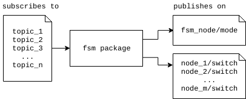

# Package `fsm` {#fsm}

The **Finite State Machine (FSM)** coordinates the modes of the car. The `fsm` package consists of two nodes, namely `fsm_node` and `logic_gate_node`. The `fsm_node` is the main node which determines the current state of the Duckiebot, and the `logic_gate_node` serves as a helper node to the `fsm_node`.



Below is a summary of the basic concept of the FSM.

* Each **state** is a mode that the Duckiebot can be in (e.g. `lane_following`, `intersection_coordination`, `joystick_control` etc.)
* Each state has corresponding **state transitions**
* Each state transition can be triggered by certain **events**
* Each event is triggered by a certain topic **message value**
* In each state, certain nodes are **active/inactive**
* Each node affected by the state machine can be **switched** active/inactive by means of a 

Below is the current **FSM diagram**, generated from the `.yaml` config file. 

  

*Side-note:*
To re-generate the FSM diagram from the `.yaml` file, there exists a Python script at `00_infrastructure/ros_diagram/parse_fsm.py`. The script will generate a `.dot` file, which can then be converted to `.png` using the following commands.
    
    python parse_fsm.py
    dot -Tpng fsm_default.dot >> fsm_defaut.png

### Usage {nonumber="1"}
The current state is published to the `fsm_node/mode` topic. For each state, there is a list of nodes which should be active, which are switched by means of `node_name/switch` topics.

The FSM node publishes on many topics `node_name_x/switch`, where `node_name_x` is the name of any node affected by the FSM. The relevant nodes then subscribe to `~/switch`, and toggle their behaviour based on the value of the switch. Nodes can also subscribe to the `fsm_node/mode` topic if they need to change their behaviour based on the specific state. An example of how a node named `ExampleNode` can handle this is shown below:

    class ExampleNode(object):
        def __init__(self):
        ...
        self.sub_switch = rospy.Subscriber("~switch",BoolStamped, self.cbSwitch, queue_size=1)
        self.sub_fsm_mode = rospy.Subscriber("fsm_node/mode",FSMState, self.cbMode, queue_size=1)
        self.active = True
        self.mode = None

        def cbSwitch(self,switch_msg):
            self.active = switch_msg.data # True or False

        def cbMode(self,switch_msg):
            self.mode = switch_msg.state # String of current FSM state

        def someOtherFunc(self, msg):
            if not self.active:
                return
            # else normal functionality
            ...
            if self.mode == "LANE_FOLLOWING":
                ...
            if self.mode == "INTERSECTION_CONTROL":
                ...

## Node `fsm_node` {#fsm-fsm_node}
### Description {nonumber="1"}

This node handles the state transitions based on the defined state transition events. Below is a summary of the basic fuctionality of the `fsm_node`.

* The node subscribes to certain topics defined in the configuration file
* Each event relates to a certain value being published on the topics
* When an event is triggered, the node calculates whether a state transition must take place
* When a state transition has taken place, the new state is published on `fsm_node/mode`
* The `/switch` topics are published with the new values for the current state

### Configuration
The `fsm_node` is configured by the `.yaml` file at ... The node will extract the information in the `yaml` file as a Python dictionary containing all the configuration data.

The file contains the following sections:

#### Initial state
This is the state that the FSM will go into when the node is launched.

``` initial_state: "NORMAL_JOYSTICK_CONTROL"```

#### Events
These are the definition of events which trigger state transitions. Each event has a corresponding `topic`, `msg_type`, and `trigger` value (of type `msg_type`) that will trigger the event.

    events:
      parallel_autonomy_on:
        topic: "joy_mapper_node/parallel_autonomy"
        msg_type: "BoolStamped"
        trigger: True


#### Nodes
This is the declaration of any nodes which are affected by the FSM and must be switched.

    nodes:
      decoder_node: "decoder_node/switch"

#### Global transitions
This is the definition of state transitions which can be triggered from any state.

    global transitions:
      joystick_override_on_and_parallel_autonomy_on: "SAFE_JOYSTICK_CONTROL"

#### States
This is the definition of all possible states. Each state has corresponding transitions, a list of active nodes in the state, and which mode the LEDs must be in.

    states:
    NORMAL_JOYSTICK_CONTROL:
        transitions:
        joystick_override_off_and_deep_lane_off: "LANE_FOLLOWING"
        joystick_override_off_and_deep_lane_on: "DEEP_LANE_FOLLOWING"
        parallel_autonomy_on: "SAFE_JOYSTICK_CONTROL"
        active_nodes:
        - lane_filter_node
        - line_detector_node
        - stop_line_filter_node
        - framerate_high
        - decoder_node
        - apriltag_node
        lights: ["joystick"]

## Node `logic_gate_node` {#fsm-logic_gate_node}

### Description {nonumber="1"}


This node handles AND and OR logic gates of events for state transitions. Below is a summary of the basic functionality of the `logic_gate_node`.

* Logic AND and OR gates can be defined
* For each gate, the input events (and their corresponding topics) are defined
* The `logic_gate_node` subscribes to all of these input event topics
* When an input topic is published, the `logic_gate_node` checks whether the AND or OR gate is satisfied
* If the gate is satisfied, the node publishes `True` on the `~/gate_name` topic, else it publishes `False`  

The logic gate node publishes on many topics according to the configuration:

    for gate_name, gate_dict in self.gates_dict.items():
        output_topic_name = gate_dict["output_topic"]
        self.pub_dict[gate_name] = rospy.Publisher(output_topic_name, BoolStamped, queue_size=1)

where `gate_dict.items()` is a dictionary of all gates, and `output_topic_name` is `~/gate_name`. The `fsm_node` then subscribes to `logic_gate_node/*`, where each `gate_name` corresponds to a state transition event. 

### Configuration
The `fsm_node` is configured by the `.yaml` file at ... The node will extract the information in the `yaml` file as a Python dictionary containing all the configuration data.

The file contains the following sections:

#### Events
These are the events that are inputs to the logic gates. 

    events:
      deep_lane_following_on:
        default: False
        topic: "joy_mapper_node/deep_learn_toggle"
        msg_type: "BoolStamped"
        trigger: True

#### Gates
This is the definition of the logic OR and/or AND gates based on event inputs. Each gate has a `gate_type` (`AND` or `OR`), input event names, and an output topic name.

    gates:
      joystick_override_on_and_parallel_autonomy_off:
        gate_type: AND
        inputs:
          - joystick_override_on
          - parallel_autonomy_off
        output_topic: "~joystick_override_on_and_parallel_autonomy_off"
